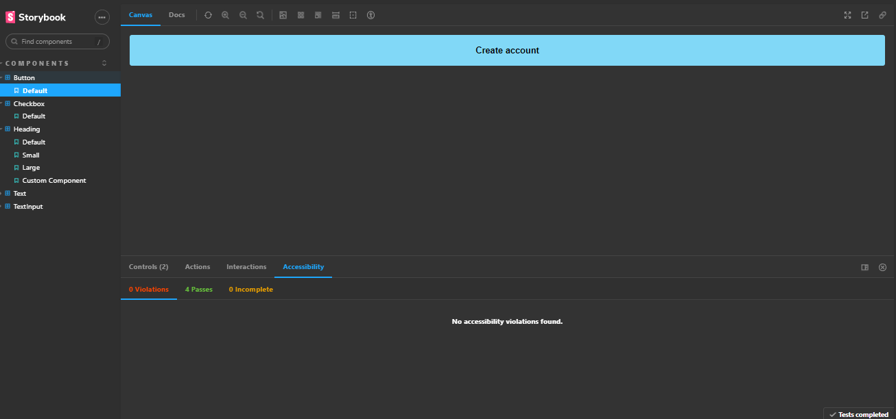

# Design System 
Neste projeto construimos um Design System do Figma ao React usando Storybook, Radix e diversas ferramentas do ecossistema do React 

## Visual do projeto
<p>
  
</p>

## Criando projeto lab-ds
```
  npm create vite@latest
```

## Iniciando o projeto
```
  npm i 
```

## Executando 
```
  npm run dev
```

## Instalando tailwindcss
```
  npm install -D tailwindcss postcss autoprefixer

  npx tailwindcss init -p 
```

## Instalar e rodar Storybook
```
  npx sb init --builder @storybook/builder-vite --use-npm

  npm run storybook
```

## Instalando pacote do npm clsx
```
  npm install --save clsx
```
## Radix UI
Instalando o radix slot
```
  npm install @radix-ui/react-slot

  npm install @radix-ui/react-checkbox

```

## Instalando Phosphor
```
  npm i phosphor-react
```

  ## Deployer
```
    npm i @storybook/storybook-deployer --save-dev
```

## Rodar o buil do storybook
```
  npm run build-storybook
```

 ## Plugins do storybook para escrever testes dos nossos stories
  Instalando 
```  
    npm i @storybook/addon-interactions @storybook/jest  @storybook/testing-library @storybook/test-runner -D 
```

## Rodar o teste
```
  npm run test-storybook

  rodar no modo watch 
  -- --watch
```

## Sites
https://www.radix-ui.com/

https://github.com/storybookjs/storybook-deployer

https://transform.tools/

https://storybook.js.org/docs/react/essentials/interactions